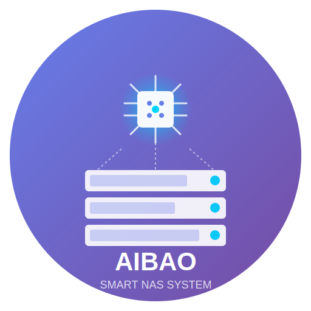

<p align="center">
  
</p>

<h1 align="center">AIBAO NAS</h1>

<p align="center">
  <strong>基于 Yocto 构建的智能网络存储系统</strong>
</p>

<p align="center">
  <a href="#特性">特性</a> •
  <a href="#系统架构">系统架构</a> •
  <a href="#快速开始">快速开始</a> •
  <a href="#开发指南">开发指南</a> •
  <a href="#路线图">路线图</a> •
  <a href="#贡献">贡献</a>
</p>

<p align="center">
  
  
  
  
</p>

---

## 简介

**AIBAO NAS** 是一款融合人工智能技术的网络存储系统，基于 [Yocto Project](https://www.yoctoproject.org/) 从零构建，专为家庭和小型企业用户设计。系统深度集成 AI 能力，提供智能文件管理、自动分类、语音交互等创新功能，同时保持 NAS 核心存储服务的高性能与高可靠性。

### 核心理念

- **🧠 智能驱动** - AI 赋能存储，让数据管理更轻松
- **🔒 安全可靠** - 企业级数据保护，隐私优先
- **⚡ 高效性能** - 针对嵌入式硬件深度优化
- **🛠️ 开放生态** - 完全开源，支持二次开发

---

## 特性

### 📦 核心存储服务

| 服务 | 描述 |
|------|------|
| **SMB/CIFS** | Windows 网络共享，支持 SMB 3.0 |
| **NFS** | Linux/Unix 网络文件系统，支持 NFS v4 |
| **AFP** | Apple 文件协议，Time Machine 备份支持 |
| **WebDAV** | 跨平台文件访问，支持 HTTPS |
| **iSCSI** | 块级存储，支持虚拟化环境 |

### 🧠 AI 智能功能

- **智能相册** - 自动识别人脸、场景、物体，智能分类整理
- **文档 OCR** - 图片文字识别，支持 PDF 搜索
- **重复文件检测** - 智能识别并清理重复文件
- **智能搜索** - 自然语言搜索，如"去年夏天的照片"
- **自动标签** - 基于文件内容的自动标签系统
- **异常检测** - 存储健康预测，提前预警

### 🔐 数据安全

- **RAID 管理** - 支持 RAID 0/1/5/6/10，软 RAID 方案
- **快照备份** - Btrfs/ZFS 快照支持，分钟级 RPO
- **加密存储** - AES-256 加密，LUKS 卷加密
- **异地备份** - 支持云存储同步（S3、阿里云 OSS 等）
- **访问控制** - 细粒度 ACL，LDAP/AD 集成

### 🌐 Web 管理界面

- 现代化响应式设计
- 一键安装应用插件
- 实时系统监控仪表盘
- 移动端适配管理

### 🔌 扩展生态

- Docker 容器支持
- 虚拟机管理（KVM）
- 插件应用商店
- RESTful API

---

## 系统架构

```
┌─────────────────────────────────────────────────────────────────┐
│                        AIBAO NAS Stack                          │
├─────────────────────────────────────────────────────────────────┤
│  ┌─────────────────────────────────────────────────────────┐    │
│  │                    User Applications                     │    │
│  │   Docker  │  VM  │  Plex  │  Nextcloud  │  HomeBridge   │    │
│  └─────────────────────────────────────────────────────────┘    │
│                              │                                   │
│  ┌─────────────────────────────────────────────────────────┐    │
│  │                   AI Service Layer                       │    │
│  │   ML Runtime  │  OCR Engine  │  Face Rec  │  NLP Model  │    │
│  └─────────────────────────────────────────────────────────┘    │
│                              │                                   │
│  ┌─────────────────────────────────────────────────────────┐    │
│  │                   Storage Services                       │    │
│  │  SMB │ NFS │ AFP │ WebDAV │ iSCSI │ FTP │ rsync │ rclone│    │
│  └─────────────────────────────────────────────────────────┘    │
│                              │                                   │
│  ┌─────────────────────────────────────────────────────────┐    │
│  │                   System Core                            │    │
│  │  Web UI  │  Auth  │  Network  │  Storage  │  Monitoring │    │
│  └─────────────────────────────────────────────────────────┘    │
│                              │                                   │
│  ┌─────────────────────────────────────────────────────────┐    │
│  │                   Yocto Poky Layer                       │    │
│  │    Kernel  │  glibc  │  systemd  │  coreutils  │  ...    │    │
│  └─────────────────────────────────────────────────────────┘    │
│                              │                                   │
│  ┌─────────────────────────────────────────────────────────┐    │
│  │                   Hardware Platform                      │    │
│  │          ARM64 (RK3588/RK3566)  │  x86_64 (Intel/AMD)    │    │
│  └─────────────────────────────────────────────────────────┘    │
└─────────────────────────────────────────────────────────────────┘
```

---

## 快速开始

### 环境要求

构建 AIBAO NAS 需要以下环境：

| 项目 | 最低要求 | 推荐配置 |
|------|---------|---------|
| **操作系统** | Ubuntu 20.04 LTS | Ubuntu 22.04 LTS |
| **CPU** | 4 核 | 8 核以上 |
| **内存** | 8 GB | 16 GB 以上 |
| **磁盘空间** | 100 GB | 200 GB 以上 |

### 构建步骤

```bash
# 1. 安装构建依赖
sudo apt update
sudo apt install -y gawk wget git diffstat unzip texinfo gcc build-essential \
    chrpath socat cpio python3 python3-pip python3-pexpect xz-utils \
    debianutils iputils-ping python3-git python3-jinja2 libegl1-mesa \
    libsdl1.2-dev python3-subunit mesa-common-dev zstd liblz4-tool

# 2. 克隆仓库
git clone https://github.com/aibao-nas/aibao-nas.git
cd aibao-nas

# 3. 初始化 Yocto 环境
source oe-init-build-env

# 4. 配置目标平台
# 编辑 conf/local.conf，设置 MACHINE 变量
# 支持平台: aibao-rk3588, aibao-rk3566, aibao-x86-64

# 5. 开始构建
bitbake aibao-nas-image

# 构建完成后，镜像位于：
# tmp/deploy/images/<MACHINE>/aibao-nas-image-<MACHINE>.wic.xz
```

### 烧录镜像

**ARM64 平台 (RK3588/RK3566):**

```bash
# 使用 rkdeveloptool 或 upgrade_tool 烧录
rkdeveloptool db rk3588_loader.bin
rkdeveloptool wl 0 aibao-nas-image-rk3588.wic
rkdeveloptool rd
```

**x86_64 平台:**

```bash
# 使用 dd 烧录到 U 盘或硬盘
xz -dc aibao-nas-image-x86-64.wic.xz | sudo dd of=/dev/sdX bs=4M status=progress conv=fsync
```

### 首次启动

1. 系统启动后，通过 DHCP 获取 IP 地址
2. 浏览器访问 `http://<NAS_IP>:8080`
3. 按向导完成初始化设置
4. 默认账户: `admin` / `aibao`（首次登录需修改密码）

---

## 开发指南

### 目录结构

```
aibao-nas/
├── meta-aibao/              # Yocto 元数据层
│   ├── conf/                # 层配置
│   ├── recipes-core/        # 核心系统配方
│   ├── recipes-ai/          # AI 服务配方
│   ├── recipes-storage/     # 存储服务配方
│   ├── recipes-web/         # Web 界面配方
│   └── recipes-kernel/      # 内核配方
├── sources/                 # 源码目录
│   ├── aibao-web/           # Web 管理界面
│   ├── aibao-ai/            # AI 服务模块
│   └── aibao-core/          # 核心守护进程
├── docs/                    # 文档
├── tools/                   # 开发工具脚本
└── README.md
```

### 编译单独组件

```bash
# 编译内核
bitbake virtual/kernel

# 编译 AI 服务
bitbake aibao-ai-service

# 编译 Web 界面
bitbake aibao-web-ui

# 编译 SDK（用于交叉编译开发）
bitbake aibao-nas-sdk
```

### 开发环境

```bash
# 使用 devshell 调试配方
bitbake -c devshell <recipe-name>

# 清理并重新编译
bitbake -c clean <recipe-name>
bitbake <recipe-name>

# 查看配方依赖
bitbake -g <recipe-name> && cat pn-buildlist
```

---

## 支持硬件

### 官方支持

| 平台 | 设备 | SoC | 状态 |
|------|------|-----|------|
| RK3588 | Orange Pi 5 Plus | Rockchip RK3588 | ✅ 支持 |
| RK3588 | Radxa ROCK 5B | Rockchip RK3588 | ✅ 支持 |
| RK3566 | Pine64 Quartz64 | Rockchip RK3566 | 🔄 开发中 |
| x86_64 | Generic 64-bit | Intel/AMD | ✅ 支持 |

### 社区支持

欢迎提交新硬件适配！请参考 [硬件适配指南](docs/hardware-porting.md)。

---

## 路线图

### v0.1.0 - Alpha (当前阶段)
- [x] 项目初始化
- [ ] 基础 Yocto 构建框架
- [ ] 最小系统镜像
- [ ] 基础 Web 管理界面

### v0.2.0 - Alpha 2
- [ ] SMB/NFS 存储服务
- [ ] 用户管理系统
- [ ] 存储池管理

### v0.5.0 - Beta
- [ ] AI 服务集成
- [ ] 智能相册功能
- [ ] Docker 支持

### v1.0.0 - Stable
- [ ] 完整存储功能
- [ ] 插件系统
- [ ] 应用商店
- [ ] 文档完善

### 未来规划
- [ ] KVM 虚拟化
- [ ] Kubernetes 集群模式
- [ ] 边缘计算节点支持

---

## 贡献

我们欢迎所有形式的贡献！

### 如何贡献

1. Fork 本仓库
2. 创建特性分支 (`git checkout -b feature/amazing-feature`)
3. 提交更改 (`git commit -m 'feat: add amazing feature'`)
4. 推送到分支 (`git push origin feature/amazing-feature`)
5. 创建 Pull Request

### 贡献指南

- 代码风格遵循各语言的社区规范
- 提交信息遵循 [Conventional Commits](https://www.conventionalcommits.org/)
- 新功能需包含相应测试
- 文档更新与代码同步

### 行为准则

请阅读并遵守我们的 [行为准则](CODE_OF_CONDUCT.md)。

---

## 社区

- 💬 [GitHub Discussions](https://github.com/aibao-nas/aibao-nas/discussions) - 问题讨论
- 🐛 [GitHub Issues](https://github.com/aibao-nas/aibao-nas/issues) - Bug 报告与功能请求
- 📖 [Wiki](https://github.com/aibao-nas/aibao-nas/wiki) - 文档与教程
- 🌐 官方网站: *coming soon*

---

## 许可证

本项目采用 [GNU General Public License v3.0](LICENSE) 许可证开源。

```
Copyright (C) 2024 AIBAO NAS Project

This program is free software: you can redistribute it and/or modify
it under the terms of the GNU General Public License as published by
the Free Software Foundation, either version 3 of the License, or
(at your option) any later version.
```

---

<p align="center">
  Made with ❤️ by AIBAO NAS Team
</p>
